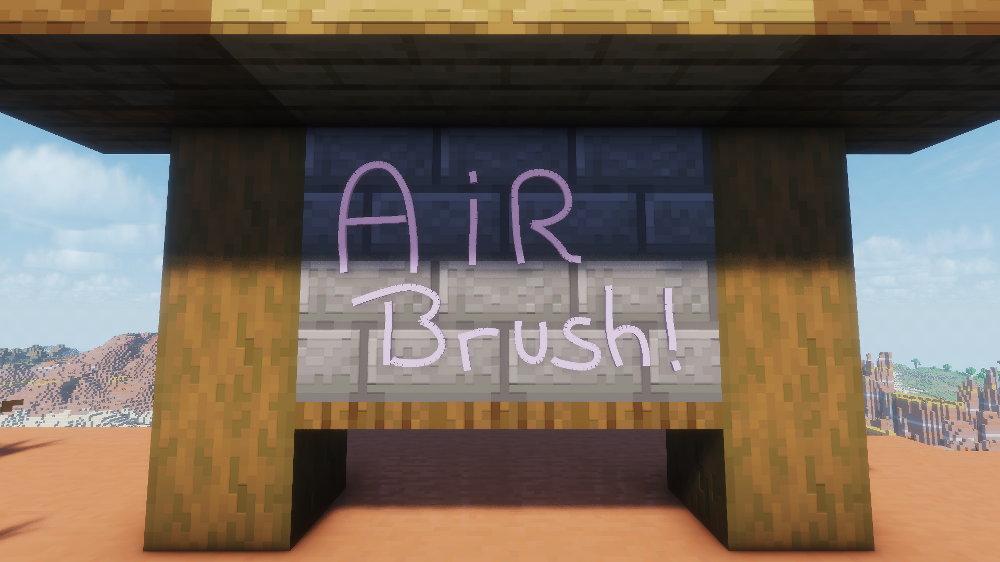
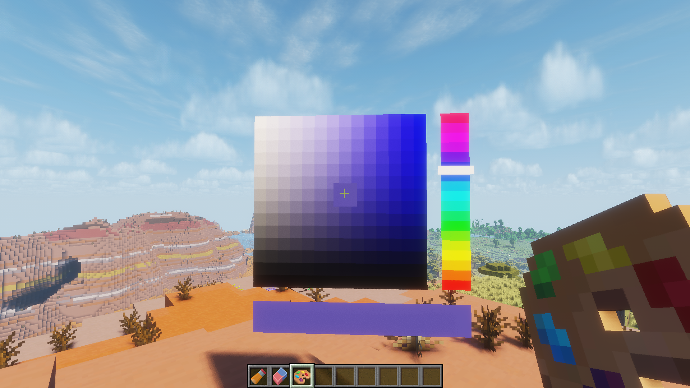

<div align="center">

# AirBrush

**Draw in the air.** A 3D pen for Paper server. Paint freehand on any surface,
pick any color, and build it together with friends.

[](https://modrinth.com/plugin/AirBrush)
[](https://discord.gg/JQVdVqyfDY)

https://github.com/user-attachments/assets/78c49754-6dba-4782-b847-a3f73eb60b47

</div>

---

## What it does

You get three tools, a **pencil**, an **eraser**, and a **palette**, and you just draw.
Strokes follow whatever you're looking at, you can pick any color, change the brush size
on the fly, and undo when you inevitably mess up.

| Freehand | Color picker |
| :---: | :---: |
|  |  |

## Requirements

- A **Paper** server (built against `26.1.2`)
- **Java 25**
- The client-side resource pack (automatically sent by the plugin)

## Installation

Drop the jar into your server's `plugins/` folder and start it up. The plugin
hosts the resource pack itself over a small built-in HTTP server.

Grab your tools in-game with `/drawitem`:

```
/drawitem pencil
/drawitem eraser
/drawitem palette
```

## Controls

### Pencil
- **Right-click** to start drawing, **right-click again** to finish.
- **Left-click** while drawing to cancel the stroke.
- **Sneak + right-click** for straight lines — each click drops a point, left-click ends it.
- **Sneak + scroll** to change the brush thickness.

### Eraser
- **Right-click** to start or stop erasing.
- **Sneak + right-click** to switch between *Area* and *Whole stroke* modes.
- **Sneak + scroll** to change the eraser size.

### Palette
- **Right-click** to open the color picker.
- **Click** to move the selector, **click again** to confirm.
- **Left-click** to close it.

## Commands

| Command | What it does | Permission |
| --- | --- | --- |
| `/color <name or #RRGGBB>` | Set the pencil color directly | everyone |
| `/undo [amount]` | Undo your last strokes | everyone |
| `/drawitem <pencil \| eraser \| palette>` | Give yourself a tool | everyone |
| `/airbrush reload` | Reload the config and language files | `airbrush.reload` |

## Support

Something broken or want to share what you made? Hop into the
[Discord](https://discord.gg/JQVdVqyfDY).

## License

AirBrush is licensed under the [GNU General Public License v3.0](LICENSE).
