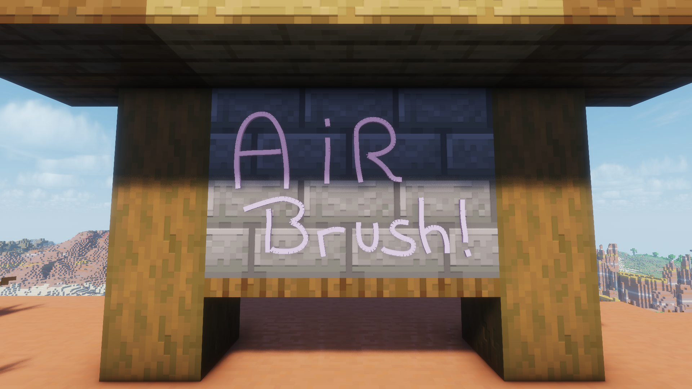
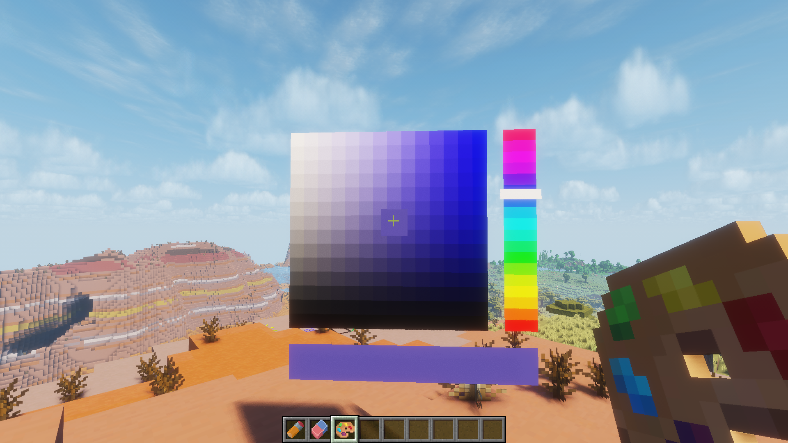

<div align="center">

# AirBrush

A 3D pen for Paper server. Paint freehand on any surface, pick any color, 
and build it together with friends.

[](https://modrinth.com/plugin/AirBrush)
[](https://discord.gg/JQVdVqyfDY)

https://github.com/user-attachments/assets/78c49754-6dba-4782-b847-a3f73eb60b47

</div>

---

## What it does

You get three tools, a **pencil**, an **eraser**, and a **palette**, and you just draw.
Strokes follow whatever you're looking at, you can pick any color, change the brush size
on the fly, and undo when you inevitably mess up.

On top of that sits the **witchcraft loop**: forge a hammer, transmute amethyst into
magic markers, draw glyphs, and activate them to craft upgraded tools.

| Freehand | Color picker |
| :---: | :---: |
|  |  |

## Requirements

- A **Paper** server (built against `1.21.4`)
- **Java 21**
- The client-side resource pack (automatically sent by the plugin)

## Installation

Drop the jar into your server's `plugins/` folder and start it up. The plugin
hosts the resource pack itself over a small built-in HTTP server.

Grab your tools in-game with `/drawitem`:

```
/drawitem pencil
/drawitem eraser
/drawitem palette
```

## Controls

### Pencil
- **Right-click** to start drawing, **right-click again** to finish.
- **Left-click** while drawing to cancel the stroke.
- **Sneak + right-click** for straight lines — each click drops a point, left-click ends it.
- **Sneak + scroll** to change the brush thickness.

### Eraser
- **Right-click** to start or stop erasing.
- **Sneak + right-click** to switch between *Area* and *Whole stroke* modes.
- **Sneak + scroll** to change the eraser size.

### Palette
- **Right-click** to open the color picker.
- **Click** to move the selector, **click again** to confirm.
- **Left-click** to close it.

## Witchcraft

### Hammer
Craft it with two iron blocks, an iron ingot and two sticks (vanilla crafting,
Paper only). It mines at stone-pickaxe speed with iron-tier drops, hits for 9
damage, and has 150 durability.

- **Punch a dropped amethyst shard** to transmute it into **Amethyst Dye** (1 durability).
- **Sneak-punch** to transmute the whole stack at once (1 durability each).
- **Punch near a finished glyph** to activate it (see below).

### Amethyst Dye (marker)
A non-permanent marker: right-click to start a glowing amethyst line, right-click
to finish, left-click to cancel (refunds the ink). Ink is durability — it drains
with line length and the marker stops (but never breaks) at 1. Strokes live for
60 seconds, thinning out before they vanish.

### Glyphs
Draw a closed **square** or **triangle** with the marker — on the
floor, a wall, anywhere flat — and decorate it with modifiers: a **focus dot**,
a **division line** or **rays**.
Drop the ingredients inside the shape and **strike it with the hammer**:

| Glyph | Ingredients inside | Result |
| --- | --- | --- |
| Triangle | 1 feather + 1 charcoal | **Quill** |
| Triangle + focus dot | 1 quill + 1 gold block | **Golden Quill** |
| Triangle + focus dot + division line | 1 golden quill + 1 diamond block | **Diamond Quill** |
| Triangle + focus dot + division line + rays | 1 diamond quill + 1 netherite block | **Netherite Quill** |
| Square | 1 white wool | **Cloth** |

How cleanly you draw matters: every crafted item records the glyph **quality**
(crude / decent / good / perfect) in its tooltip — and for quills, quality and
tier improve line fineness and ink efficiency.

### Inks & the cauldron
Quills don't draw for free: they carry **ink**, and ink is brewed in a **water
cauldron**. Toss the ingredients in and wait a moment:

| Ingredients in the cauldron | Brew |
| --- | --- |
| 1 ink sac | **Common Ink** |
| 1 amethyst shard | **Amethyst Ink** |
| 1 glow ink sac + 1 amethyst shard | **Luminous Ink** (glows in the dark) |
| 1 echo shard + 1 diamond + 1 amethyst block | **Indelible Ink** (permanent) |
| 1 echo shard + 1 diamond + 1 amethyst block + 1 glow ink sac | **Luminous Indelible Ink** |
| 1 slime ball + 1 fermented spider eye | **Solvent** |

Drop vanilla **dyes** into an ink brew to pull its color toward them, then
**right-click the cauldron with a quill** to load it. Strokes of non-permanent
inks fade away after a while; indelible ones stay until erased.

### Cloth
Crafted from a square glyph, the cloth is a finer eraser: soak it in a cauldron
of **solvent** and it wipes strokes away, drying out as it works. Dip it again
to rewet it.

## Commands

| Command | What it does | Permission |
| --- | --- | --- |
| `/color <name or #RRGGBB>` | Set the pencil color directly | everyone |
| `/undo [amount]` | Undo your last strokes | everyone |
| `/drawitem <pencil \| eraser \| palette \| amethyst_dye \| hammer \| cloth \| quill \| quill_gold \| quill_diamond \| quill_netherite>` | Give yourself a tool | `airbrush.drawitem` (op) |
| `/glyphtest [particles]` | Analyze nearby glyph strokes (debug) | `airbrush.debug` |
| `/airbrush reload` | Reload the config and language files | `airbrush.reload` |

## Support

Something broken or want to share what you made? Hop into the
[Discord](https://discord.gg/JQVdVqyfDY).

## License

AirBrush is licensed under the [GNU General Public License v3.0](LICENSE).
