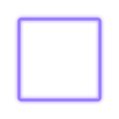
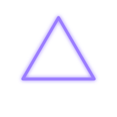
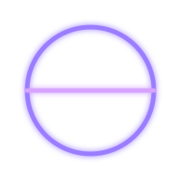
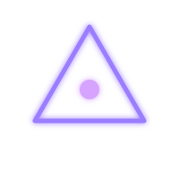

# Craftings

AirBrush items are made in three ways:

1. **At a crafting table** — the hammer, with a normal vanilla recipe.
2. **By transmuting drops with the hammer** — punch a dropped item to convert it.
3. **By drawing glyphs** — draw a shape with a marker or quill, drop the ingredients
   inside it, and strike it with the hammer.

## Crafting table

### Hammer

A vanilla shaped recipe — works in any crafting table.

|       |              |       |
| :---: | :----------: | :---: |
| Iron Block | Iron Ingot | Iron Block |
|       |    Stick     |       |
|       |    Stick     |       |

The hammer mines pickaxe-mineable blocks at iron-tier with increased mining speed,
hits for **9** attack damage, and has **150** durability. Beyond mining and combat,
it is the tool that drives every craft below.

## Hammer transmutation

### Amethyst Dye

Drop an **amethyst shard** on the ground and **punch it with the hammer** to transmute
it into an **Amethyst Dye** marker. **Sneak-punch** to convert a whole stack at once.

Each conversion costs **1** hammer durability, and the resulting marker carries
**Amethyst ink** with 100 points of ink to spend.

## Glyph crafting

A glyph is a closed **base shape** drawn with a marker or quill, optionally decorated
with one or more **modifiers**. Draw it on any flat surface — floor, wall, ceiling —
drop the listed ingredients **inside** the shape, and **strike it with the hammer**.

### Base shapes

-   

    **Square**

-   

    **Triangle**

### Modifiers

Modifiers are extra strokes drawn on or around the base shape. The glyph system
recognises three of them:

-   

    **Focus dot**

    A small mark near the centre of the shape.

-   

    **Division line**

    A straight line through the centre, crossing the boundary on both ends.

-   

    **Rays**

    Three or more short strokes pointing outward from the boundary.

!!! warning "Keep the glyph clean"
    A recipe only matches when the glyph has **exactly** its listed modifiers —
    extra strokes or shapes inside the glyph count as noise, lower the quality
    score and can make the craft fail.

### Quills

The quill is the main drawing pen. Each tier asks for a slightly more complex glyph,
plus a block of the matching metal and the quill of the tier below. Higher tiers hold
more ink, use it more efficiently, reach further and draw finer.

-   

    **Quill**

    ---

    Triangle

    1 feather + 1 charcoal

-   

    **Gold Quill**

    ---

    Triangle + focus dot

    1 quill + 1 gold block

-   

    **Diamond Quill**

    ---

    Triangle + focus dot + division line

    1 gold quill + 1 diamond block

-   

    **Netherite Quill**

    ---

    Triangle + focus dot + division line + rays

    1 diamond quill + 1 netherite block

!!! tip "Filling the quill"
    A freshly crafted quill is nearly empty. Brew ink in a cauldron and dip the quill
    to fill it — see [Inks & cauldrons](inks.md).

### Cloth

The cloth is the quill's eraser. Soak it with solvent in a cauldron to recharge it.

-   

    **Cloth**

    ---

    Square

    1 white wool

!!! note "What about the pencil, eraser and palette?"
    Those are [creative/admin tools](tools.md) handed out with `/drawitem` —
    they have no glyph recipe. In survival, the **quill** is your pen (color
    comes from the [cauldron ink](inks.md)) and the **cloth** is your eraser.

!!! note "Quality matters"
    How cleanly you draw the glyph is scored as a **quality** grade
    (crude / decent / good / perfect) and stored in the crafted item's tooltip —
    it affects quill and cloth capacity. Use [`/glyphtest`](commands.md) to analyze
    nearby strokes while practising.
